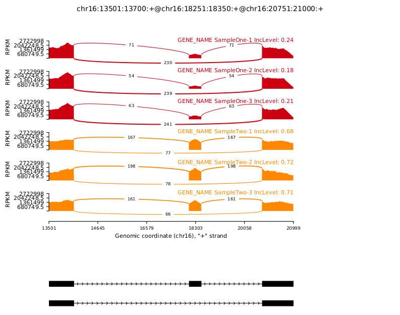
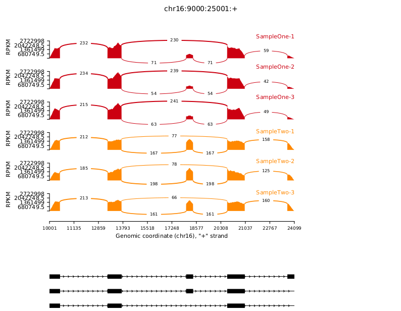
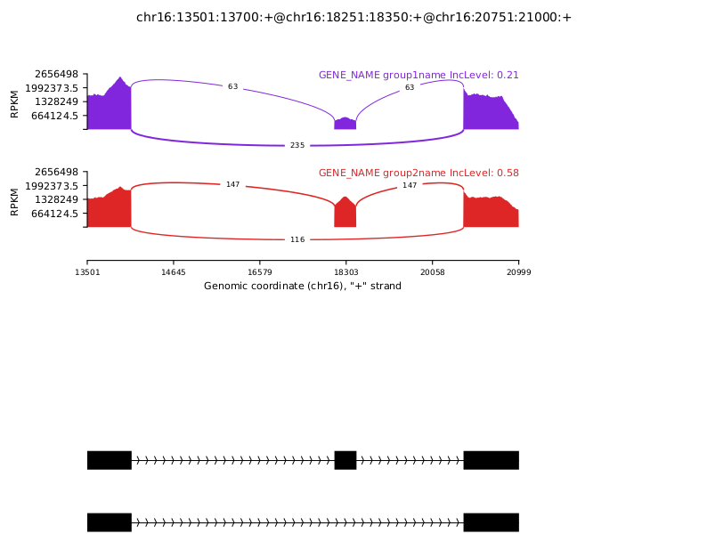

# rmats2sashimiplot

[](https://github.com/Xinglab/rmats2sashimiplot/releases/latest)
[](https://anaconda.org/bioconda/rmats2sashimiplot)
[](https://pypi.org/project/rmats2sashimiplot/)
[](https://hub.docker.com/r/xinglab/rmats2sashimiplot)

## About

rmats2sashimiplot produces a sashimiplot visualization of [rMATS](https://github.com/Xinglab/rmats-turbo) output. rmats2sashimiplot can also produce plots using an annotation file and genomic coordinates. The plotting backend is [MISO](https://miso.readthedocs.io).

## Table of contents

- [Dependencies](#dependencies)
- [Install](#install)
- [Usage](#usage)
  * [Examples](#examples)
    + [SAM files with rMATS event](#sam-files-with-rmats-event)
    + [BAM files with coordinate and annotation](#bam-files-with-coordinate-and-annotation)
    + [Using a group file](#using-a-group-file)
  * [Grouping](#grouping)
  * [FAQ](#faq)
  * [All arguments](#all-arguments)
- [Output](#output)
- [Contacts and bug reports](#contacts-and-bug-reports)
- [Copyright and License Information](#copyright-and-license-information)

## Dependencies

- Python 2.7 (Python 3 can be used after running [2to3.sh](2to3.sh))
  * numpy
  * scipy
  * matplotlib
  * pysam
- Samtools
- bedtools

rmats2sashimiplot is intended to be used in a Unix-based environment.

## Install

rmats2sasmimiplot can be run without installing:
```
python ./src/rmats2sashimiplot/rmats2sashimiplot.py
```

rmats2sashimiplot can be installed with:
```
python ./setup.py install
```

rmats2sashimiplot can be updated with:
```
pip uninstall rmats2sashimiplot
python ./setup.py install
```

If installed, rmats2sashimiplot can be run with just:
```
rmats2sashimiplot
```

## Usage

**BAM files must be sorted before visualization/indexing.**

The test data used in the examples is available at [https://sourceforge.net/projects/rnaseq-mats/files/rmats2sashimiplot/rmats2sashimiplot_test_data.tar.gz/download](https://sourceforge.net/projects/rnaseq-mats/files/rmats2sashimiplot/rmats2sashimiplot_test_data.tar.gz/download)

### Examples

#### SAM files with rMATS event

```
rmats2sashimiplot --s1 ./rmats2sashimiplot_test_data/sample_1_replicate_1.sam,./rmats2sashimiplot_test_data/sample_1_replicate_2.sam,./rmats2sashimiplot_test_data/sample_1_replicate_3.sam --s2 ./rmats2sashimiplot_test_data/sample_2_replicate_1.sam,./rmats2sashimiplot_test_data/sample_2_replicate_2.sam,./rmats2sashimiplot_test_data/sample_2_replicate_3.sam --event-type SE -e ./rmats2sashimiplot_test_data/SE.MATS.JC.txt --l1 SampleOne --l2 SampleTwo --exon_s 1 --intron_s 5 -o test_events_output
```

Instead of providing the .sam paths directly on the command line, text files with the comma separated paths on the first line can be given: `--s1 s1.txt` and `--s2 s2.txt`. s1.txt would contain:
```
./rmats2sashimiplot_test_data/sample_1_replicate_1.sam,./rmats2sashimiplot_test_data/sample_1_replicate_2.sam,./rmats2sashimiplot_test_data/sample_1_replicate_3.sam
```
s2.txt would contain:
```
./rmats2sashimiplot_test_data/sample_2_replicate_1.sam,./rmats2sashimiplot_test_data/sample_2_replicate_2.sam,./rmats2sashimiplot_test_data/sample_2_replicate_3.sam
```



#### BAM files with coordinate and annotation

```
rmats2sashimiplot --b1 ./rmats2sashimiplot_test_data/sample_1_replicate_1.bam,./rmats2sashimiplot_test_data/sample_1_replicate_2.bam,./rmats2sashimiplot_test_data/sample_1_replicate_3.bam --b2 ./rmats2sashimiplot_test_data/sample_2_replicate_1.bam,./rmats2sashimiplot_test_data/sample_2_replicate_2.bam,./rmats2sashimiplot_test_data/sample_2_replicate_3.bam -c chr16:+:9000:25000:./rmats2sashimiplot_test_data/annotation.gff3 --l1 SampleOne --l2 SampleTwo --exon_s 1 --intron_s 5 -o test_coordinate_output
```

Instead of providing the .bam paths directly on the command line, text files with the comma separated paths on the first line can be given: `--b1 b1.txt` and `--b2 b2.txt`



#### Using a group file

Input mapping files can be divided into different groups for plotting. rmats2sashimiplot calculates the average inclusion level, the average read depth and the average number of junction-spanning reads of each group and displays them in a sashimi plot. This provides the flexibility to compare different groups of samples.

```
rmats2sashimiplot --b1 ./rmats2sashimiplot_test_data/sample_1_replicate_1.bam,./rmats2sashimiplot_test_data/sample_1_replicate_2.bam,./rmats2sashimiplot_test_data/sample_1_replicate_3.bam --b2 ./rmats2sashimiplot_test_data/sample_2_replicate_1.bam,./rmats2sashimiplot_test_data/sample_2_replicate_2.bam,./rmats2sashimiplot_test_data/sample_2_replicate_3.bam --event-type SE -e ./rmats2sashimiplot_test_data/SE.MATS.JC.txt --l1 SampleOne --l2 SampleTwo --exon_s 1 --intron_s 5 -o test_grouped_output --group-info grouping.gf
```



Where grouping.gf has:

```
group1name: 1-2
group2name: 3-6

```

### Grouping

Each line in the \*.gf file used with --group-info defines a group. Each line has the format:
```
groupname: indices of mapping files
```

The indices can be a comma (`,`) separated list of

- individual numbers
- ranges specified with dash (`-`)

**Important:** One-based indexing is used. The order of mapping files corresponds to the order from (--b1 --b2) or (--s1 --s2). Index **i** corresponds to the one-based **i**th index of the concatenation of either (--b1 and --b2) or (--s1 and --s2).

As an example: --b1 a.bam,b.bam,c.bam --b2 d.bam,e.bam,f.bam with this grouping file
```
firstGroup: 1,4
secondGroup: 1-3,5,6
```

Defines firstGroup=a.bam,d.bam and secondGroup=a.bam,b.bam,c.bam,e.bam,f.bam

### FAQ

Q: What does the y-axis represent?

A: MISO is the actual plotting backend of rmats2sashimiplot, so they have almost the same mechanism of plotting. The y-axis represents a modified RPKM value.


In rmats2sashimiplot each read distributes its read count evenly over the coordinates it was mapped to. If the read is length 50 then each individual coordinate gets 1/50 added to its value. The value at each coordinate is aggregated across all reads. Then the value is normalized by the total number of reads and the two constants (1,000 and 1,000,000).

Q: How does rmats2sashimiplot calculate junction count, read density (modified RPKM) and inclusion level in the grouping mode?

A: rmats2sashimiplot uses a modified Sashimi plot proposed by SplicePlot(Wu, Nance, & Montgomery, 2014). Briefly, rmats2sashimiplot calculates the average read depth and the average number of junction-spanning reads for groups.

Q: Can I use a GTF file?

A: No a GFF3 file is needed. You can convert a GTF to a GFF3 with [gffread](https://github.com/gpertea/gffread): `gffread --keep-genes ./some_file.gtf -o ./some_file.gff3`

Q: Why might the junction counts shown in the sashimiplot differ from the counts in the rMATS output?

A: There are several differences in the counting procedure between rmats2sashimiplot and rMATS. Please refer to [issue 33](https://github.com/Xinglab/rmats2sashimiplot/issues/33) for more details.

Q: What can I do to reduce the running time of rmats2sashimiplot?

A: rmats2sashimiplot is single threaded, but you can run multiple instances of rmats2sashimiplot concurrently on different inputs. For a single instance of rmats2sashimiplot, if an event file is given as input with `-e` it will plot all the events in that file. Instead of using an rMATS output file directly (like SE.MATS.JC.txt), you could make a copy of that file and filter it down so that it only contains the events that you want to plot.

### All Arguments

```
python src/rmats2sashimiplot/rmats2sashimiplot.py -h

usage: rmats2sashimiplot [-h] -o OUT_DIR [--l1 L1] [--l2 L2]
                         [--event-type {SE,A5SS,A3SS,MXE,RI}] [-e EVENTS_FILE]
                         [-c COORDINATE] [--s1 S1] [--s2 S2] [--b1 B1]
                         [--b2 B2] [--exon_s EXON_S] [--intron_s INTRON_S]
                         [--group-info GROUP_INFO] [--min-counts MIN_COUNTS]
                         [--color COLOR] [--font-size FONT_SIZE]
                         [--fig-height FIG_HEIGHT] [--fig-width FIG_WIDTH]
                         [--hide-number] [--no-text-background]
                         [--keep-event-chr-prefix] [--remove-event-chr-prefix]

optional arguments:
  -h, --help            show this help message and exit

Required:
  -o OUT_DIR            The output directory.

Labels:
  --l1 L1               The label for the first sample.
  --l2 L2               The label for the second sample.

rMATS event input:
  Use either (rMATS event input) or (Coordinate and annotation input)

  --event-type {SE,A5SS,A3SS,MXE,RI}
                        Type of event from rMATS result used in the analysis.
                        'SE': skipped exon, 'A5SS': alternative 5' splice
                        site, 'A3SS' alternative 3' splice site, 'MXE':
                        mutually exclusive exons, 'RI': retained intron. (Only
                        if using rMATS event input)
  -e EVENTS_FILE        The rMATS output event file (Only if using rMATS event
                        input)

Coordinate and annotation input:
  Use either (Coordinate and annotation input) or (rMATS event input)

  -c COORDINATE         The genome region coordinates and a GFF3 (not GTF)
                        annotation file of genes and transcripts. The format
                        is -c
                        {chromosome}:{strand}:{start}:{end}:{/path/to/gff3}
                        (Only if using Coordinate and annotation input)

SAM Files:
  Mapping results for sample_1 & sample_2 in SAM format. Replicates must be
  in a comma separated list. A path to a file containing the comma separated
  list can also be given. (Only if using SAM)

  --s1 S1               sample_1 sam files: s1_rep1.sam[,s1_rep2.sam]
  --s2 S2               sample_2 sam files: s2_rep1.sam[,s2_rep2.sam]

BAM Files:
  Mapping results for sample_1 & sample_2 in BAM format. Replicates must be
  in a comma separated list. A path to a file containing the comma separated
  list can also be given. (Only if using BAM)

  --b1 B1               sample_1 bam files: s1_rep1.bam[,s1_rep2.bam]
  --b2 B2               sample_2 bam files: s2_rep1.bam[,s2_rep2.bam]

Optional:
  --exon_s EXON_S       How much to scale down exons. Default: 1
  --intron_s INTRON_S   How much to scale down introns. For example,
                        --intron_s 5 results in an intron with real length of
                        100 being plotted as 100/5 = 20. Default: 1
  --group-info GROUP_INFO
                        The path to a *.gf file which groups the replicates.
                        One sashimi plot will be generated for each group
                        instead of the default behavior of one plot per
                        replicate
  --min-counts MIN_COUNTS
                        Individual junctions with read count below --min-
                        counts will be omitted from the plot. Default: 0
  --color COLOR         Specify a list of colors with one color per plot.
                        Without grouping there is one plot per replicate. With
                        grouping there is one plot per group: --color
                        '#CC0011[,#FF8800]'
  --font-size FONT_SIZE
                        Set the font size. Default: 8
  --fig-height FIG_HEIGHT
                        Set the output figure height (in inches). Default is 7
                        if sample size < 5 and 14 if sample size is 5 or more
  --fig-width FIG_WIDTH
                        Set the output figure width (in inches). Default: 8
  --hide-number         Do not display the read count on the junctions
  --no-text-background  Do not put a white box behind the junction read count
  --keep-event-chr-prefix
                        force the contig name in the provided events file to
                        be used
  --remove-event-chr-prefix
                        remove any leading "chr" from contig names in the
                        provided events file
```

## Output

All output is written to the directory specified by `-o`. Under that directory:

- `Sashimi_index/`: contains intermediate files used to create the plot
- `Sashimi_index_{Gene}_{event_id}/`: like `Sashimi_index/` but one directory for each rMATS event plotted
- `Sashimi_plot/`: contains the generated sashimi plots in .pdf format


## Contacts and bug reports

Yi Xing
yxing@ucla.edu

Zhijie Xie
shiehshiehzhijie@gmail.com

If you found a bug or mistake in this project, we would like to know about it.
Before you send us the bug report though, please check the following:

1. Are you using the latest version? The bug you found may already have been
   fixed.
2. Check that your input is in the correct format and you have selected the
   correct options.
3. Please reduce your input to the smallest possible size that still produces
   the bug; we will need your input data to reproduce the problem, and the
   smaller you can make it, the easier it will be.

## Copyright and License Information

Copyright (C) 2015 University of California, Los Angeles (UCLA)
Zhijie Xie, Yu-Ting Tseng, Yi Xing

Zhijie Xie, Yu-Ting Tseng, Yi Xing

This program is free software: you can redistribute it and/or modify it under
the terms of the GNU General Public License as published by the Free Software
Foundation, either version 3 of the License, or (at your option) any later
version.

This program is distributed in the hope that it will be useful, but WITHOUT
ANY WARRANTY; without even the implied warranty of MERCHANTABILITY or FITNESS
FOR A PARTICULAR PURPOSE. See the GNU General Public License for more details.

You should have received a copy of the GNU General Public License along with
this program. If not, see http://www.gnu.org/licenses/.
